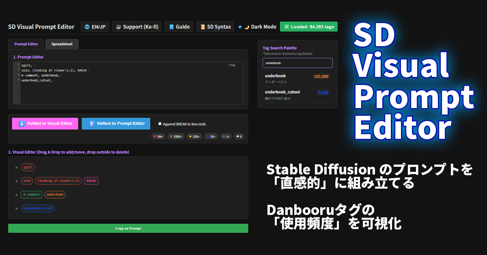

# **SD Visual Prompt Editor**

Stable Diffusion向けのプロンプト（呪文）を、**Danbooruタグの出現頻度に基づいて色分け**し、ドラッグ＆ドロップで直感的に編集・管理できるビジュアルエディタです。

\

\

\</p\>

## **✨ 主な機能**

- **🎨 ビジュアル編集**: プロンプトを「タグの塊」として可視化。ドラッグ＆ドロップで並べ替え、削除が可能。
- **📊 頻度ベースの色分け**: Danbooruデータセットに基づき、メジャーなタグ（赤/橙）からマイナーなタグ（青）まで枠線の色で識別。AIへの伝わりやすさを視覚的に確認できます。
- **📋 スプレッドシート連携**: ExcelやGoogle Sheetsの表データ（TSV）をそのまま貼り付けて、カンマ区切りのプロンプト形式に相互変換・編集可能。
- **🛠 強力な構文サポート**: (emphasized:1.2), \<lora:name:1.0\>, BREAK, \[a|b\] などのSD特有構文を正しく認識・保護します。
- **🌍 多言語対応**: 日本語/英語のUI切り替えに対応。

## **🚀 クイックスタート**

本アプリはクライアントサイド（ブラウザのみ）で動作する静的Webアプリです。

### **ローカルで実行する場合**

1. リポジトリをクローンまたはダウンロードします。  
   git clone \[https://github.com/your-name/sd-visual-prompt-editor.git\](https://github.com/your-name/sd-visual-prompt-editor.git)

2. フォルダ内の **index.html** をブラウザ（Chrome, Edge, Firefoxなど）で開くだけで使用可能です。
3. _(オプション)_ ローカルサーバーを使用する場合は、付属の start_server.bat (Windows用) を実行してください。

## **📚 ドキュメント**

利用方法や開発に関する詳細は、以下のドキュメントを参照してください。

### **📖 ユーザーガイド**

ツールの詳細な使い方は、同梱の [**ユーザーマニュアル (readme.html)**](https://www.google.com/search?q=readme.html) をご覧ください。

- 基本的な操作方法
- スプレッドシート（TSV）モードの仕様
- タグ検索パレットの使い方

### **🛠 開発者ドキュメント (MkDocs)**

内部構造やカスタマイズについては、docs/ 以下の技術ドキュメントを参照してください。

（MkDocsを導入している場合、mkdocs serve で閲覧可能です）

- [**アーキテクチャ (Architecture)**](https://www.google.com/search?q=docs/architecture.md): DOM構造、データフロー図
- [**デザインシステム (Design)**](https://www.google.com/search?q=docs/design.md): カラーパレット、タグ色分けの定義
- [**データ更新ツール**](https://www.google.com/search?q=docs/api_python.md): update_data.py の仕様

## **🔧 データセットの更新**

タグ辞書データ (danboru_dictionary.json) を最新化したい場合は、Pythonスクリプトを使用します。

\# data.tsv (Danbooruタグデータ) を配置して実行  
python update_data.py

## **🤝 ライセンス**

[MIT License](https://www.google.com/search?q=LICENSE)

_Created by Kotonone Minazuki_
